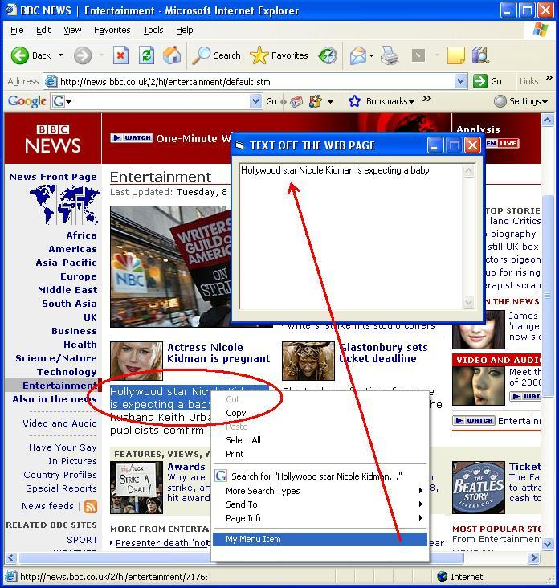



## Web Text Grabber \- another way that works with latest Internet Explorer

### Description

Grabs selected text off Internet Explorer web page and passes it to your VB EXE.

This app is very similar to an earlier posting in 2002 but this one works with even the latest version of Internet Explorer.

The VB portion is as teeny weeny as that yellow polka dot swim-wear...

But the point is to be able to show you all how you can get that WEB TEXT to your VB App. with the RIGHT MOUSE BUTTON.

Enjoy,

Kevin Ritch

V8Software.com
 
### More Info
 
Uses a REG FILE.

Please open it in notepad and check it out.

This is pretty simple really.

The javascript in the HTML will make sense.

Even to us VB programmers, it really is easy to read.

There's a detailed READ ME FILE

             |
---                |---
**Submitted On**   |2008-01-08 23:19:04
**By**             |[Kevin Ritch](https://github.com/Planet-Source-Code/PSCIndex/blob/master/ByAuthor/kevin-ritch.md)
**Level**          |Advanced
**User Rating**    |5.0 (10 globes from 2 users)
**Compatibility**  |VB 6\.0
**Category**       |[Complete Applications](https://github.com/Planet-Source-Code/PSCIndex/blob/master/ByCategory/complete-applications__1-27.md)
**World**          |[Visual Basic](https://github.com/Planet-Source-Code/PSCIndex/blob/master/ByWorld/visual-basic.md)
**Archive File**   |[Web\_Text\_G209657182008\.zip](https://github.com/Planet-Source-Code/kevin-ritch-web-text-grabber-another-way-that-works-with-latest-internet-explorer__1-69885/archive/master.zip)

